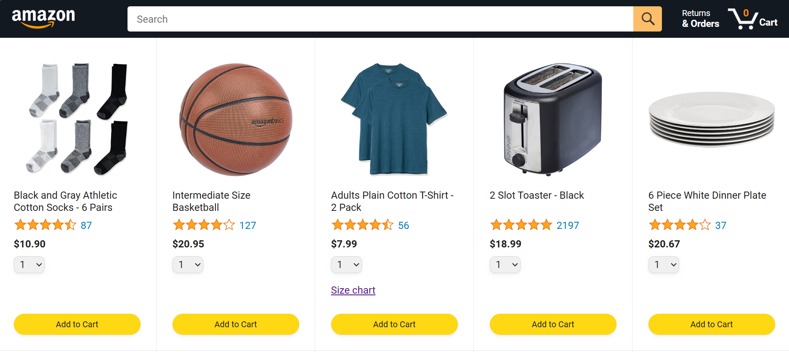
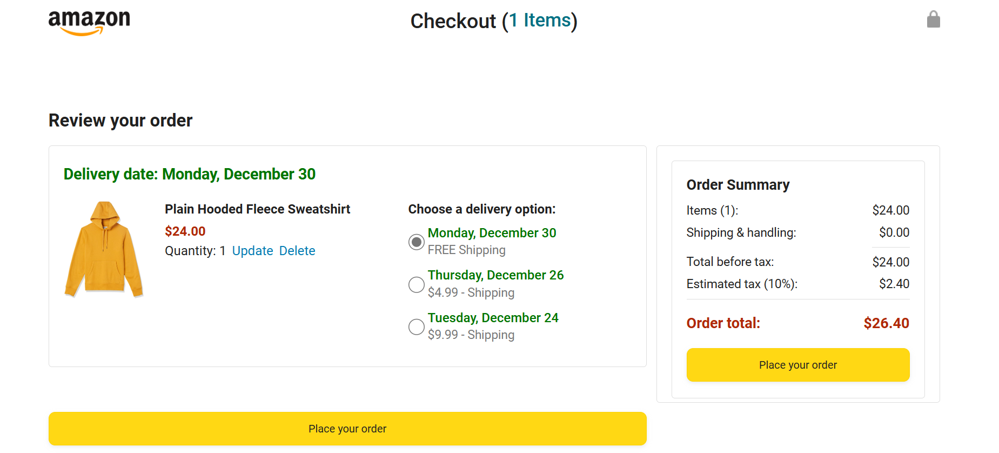
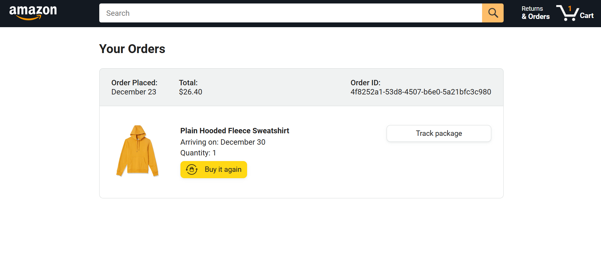
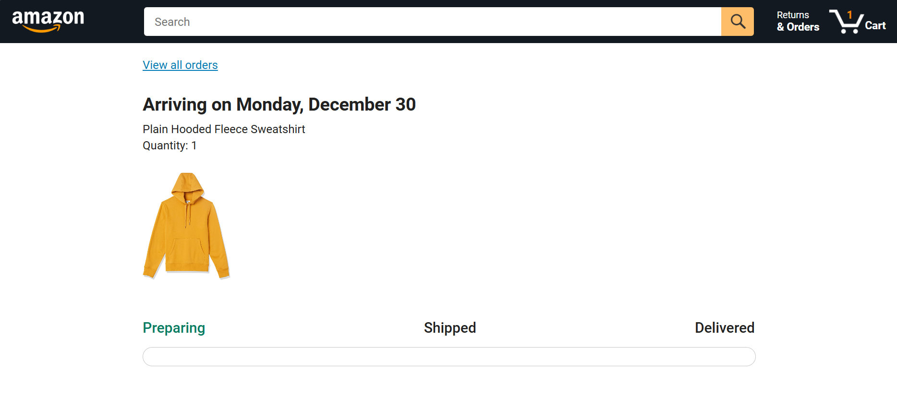

# E-Commerce Website Project

## 🌟 Overview
This project is a fully functional e-commerce website inspired by platforms like Amazon. It allows users to:
- Browse products on the **Home Page**.
- Add items to their cart and proceed to the **Checkout Page**.
- View past purchases on the **Orders Page**.
- Track shipment progress on the **Track Order Page**.

## 🚀 Live Demo
[Link to Live Demo](https://khalidibnfaraj.github.io/Amazon-JavaScript-Functionalities/)

## 🎯 Features
- **Responsive Design**: Accessible across various devices.
- **Dynamic Functionality**: Powered by JavaScript for interactive elements.
- **Order Management**: Tracks and displays past and current orders.
- **User-Friendly Navigation**: Seamlessly transitions between pages.

## 🛠️ Tech Stack
- **HTML5**: Structure and content.
- **CSS3**: Styling and layout.
- **JavaScript (ES6+)**: Functionality and interactivity.
- **Version Control**: Git and GitHub for code management.

## 📸 Screenshots
### Home Page

### Checkout Page

### Orders Page

### Track Order Page

## 🚀 About  

This project demonstrates foundational skills in **web development**, focusing on replicating the structure and design of a real-world website.  

## 🤝 Contribute  

Feel free to:  
- Explore the code.  
- Learn from the implementation.  
- Share your improvements!
  
## 📧 Contact
For any inquiries, reach out to me via:

- Email: khalidfarajdev@gmail.com
- LinkedIn: [Khalid Faraj](https://www.linkedin.com/in/khalidfaraj/)

##
Happy coding! 💻✨
